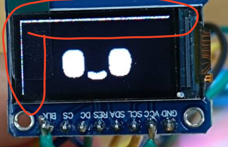

# emotion_esp32_animate
*ขอขอบคุณส่วนของเว็บไซต์ makerworld.com ที่ได้เผยแพร่ code ส่วนผมเป็นผู้ที่นำมาต่อยอดโปรเจคต่างๆ*

[อ้างอิง](https://makerworld.com/en/models/1557199-notchi-mini-robot-companion-accessory#profileId-1636211)
[Code อ้างอิง](https://drive.google.com/drive/folders/1K8lKehPyC5Ysta6jyVUPK2eaRmnuKCiN)

## *ความน่าสนใจ*
ผมพยายามค้นหา แต่ไม่มีใครแจกจ่ายเลย ซึ่งตรงนี้เองเป็นที่น่าเสียดายมาก ที่บางคนได้มาจากบุคคลนิรนาม แต่หวงไว้ไม่เอามาแจกจ่ายต่อตามวัตถุประสงค์

## ดังนั้น
เมื่อผมได้ต่อมาอีกที และดำเนินการปรับปรุงบางส่วน แก้ไขในส่วนของการใช้งาน oled ssd1306 และต่อบยอดปรับแต่งใช้กับ TFT ST7735 จึงมีความประสงค์ที่จะแจกจ่ายให้ทุกท่านที่สนในสามารถเข้ามาโหลดเพื่อไปใช้งานได้

## สุดท้ายนี้
จะพยายามอับเดทเนื้อหา เพื่อให้ผู้อื่นนำไปใช้งานได้ง่ายที่สุด

---

## แปลงภาพ gif ไปเป็น HEX

**สำหรับ GIF แต่ละไฟล์ (ตั้งแต่ไฟล์ที่ 1 ถึง 40) ให้ทำตามนี้**

[เว็บไซต์สำหรับแปลง](https://tomeko.net/online_tools/file_to_hex.php)

1. อัปโหลดไฟล์ GIF อันที่ 1 ของท่าน
2. คัดลอกเฉพาะข้อมูล Hex ที่อยู่ในช่อง Output
3. กลับมาที่ไฟล์ animation.h ของท่าน หรือไฟล์ 1.h, ..., 41.h หรือจะสร้างใหม่
4. สร้างตัวแปรสำหรับกำหนดค่า โดยพิมพ์ว่า:

```C
const uint8_t _1[] PROGMEM = {
  // วางข้อมูล Hex ของไฟล์ที่ 1 ตรงนี้
};
```
5. ทำซ้ำ! กลับไปที่เว็บไซต์ อัปโหลดไฟล์ GIF อันที่ 2, คัดลอก Hex, แล้วกลับมาสร้างตัวแปรวนไปเรื่อยๆ animation.h ของท่าน หรือไฟล์ 1.h, ..., 41.h หรือจะสร้างใหม่:
```C
const uint8_t _2[] PROGMEM = {
  // วางข้อมูล Hex ของไฟล์ที่ 2 ตรงนี้
};
```
ทำแบบนี้ไปเรื่อยๆ จนครบ _40 เลย หรือจะเป็นไฟล์ใมห่ก็ได้

## การเรียกใช้งาน
ในไฟล์ animation.h จะเรียกใช้ไฟล์ย่อย 1.h, ..., 40.h และสุดท้ายไฟล์ animation.h จะถูกไฟล์ *.ino อีกที 

---

# การเชื่อมต่อ board และ TFT 0.96
## Board ESP32 C3 ZERO
ในที่นี้ใช้งานบอร์ด ESP32 C3 ZERO ซึ่งเป็น sigle core ทำงานได้ดีแต่ออาจะไม่ราบรื่น แนะนำให้ใช้งานเป็น c3 แบบ dual core จะดีกว่า หรือเป็น s3 ก็ใช้งานได้ราบรื่นมาก

## เดินสายไฟ (ยึดตามนี้เป็นหลัก)

1. SCK -> GPIO 6
2. SDA (MOSI) -> GPIO 7
3. RES -> GPIO 3
4. DC -> GPIO 4
5. CS -> GPIO 5
6. VCC -> 3V3
7. GND -> GND
8. BLK -> 3V3

---
# แก้ไขปัญหา
มีปัญหาเส้นแสดงผลขอบบนและขอบด้านซ้าย

### ปล. ยังไม่เสร็จสิ้น

---

## My Open-Source Contribution: Building on "Notchi Mini Robot Companion Accessory"
First and foremost, I'd like to express my gratitude to makerworld.com for sharing the original code, which served as the foundation for my ongoing projects.

## The Journey to Open Source
Initially, I found the project highly interesting but noticed a lack of publicly available distributions or continued development. It was truly disappointing to see that some individuals, after obtaining the code from anonymous sources, chose to hoard it instead of sharing it further, which goes against the spirit of open collaboration.

## My Contribution
Therefore, after acquiring the code myself and undertaking several improvements, particularly in adapting it for OLED SSD1306 and further developing it to work with TFT ST7735 displays, I'm now making it available for everyone interested to download and use.

## Looking Ahead
I will strive to update the content regularly to ensure it's as user-friendly as possible for everyone.

### P.S. The project is still under development.